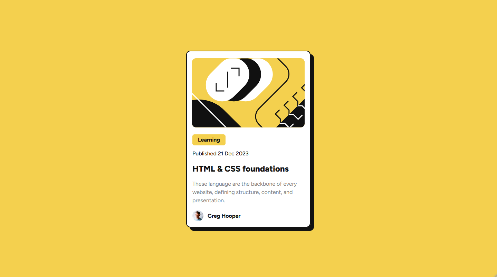
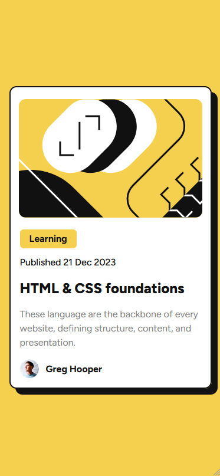

# Frontend Mentor - Blog preview card solution

This is a solution to the [Blog preview card challenge on Frontend Mentor](https://www.frontendmentor.io/challenges/blog-preview-card-ckPaj01IcS). Frontend Mentor challenges help you improve your coding skills by building realistic projects. 

## Table of contents

- [Overview](#overview)
  - [The challenge](#the-challenge)
  - [Screenshot](#screenshot)
  - [Links](#links)
- [My process](#my-process)
  - [Built with](#built-with)
  - [What I learned](#what-i-learned)
  - [Continued development](#continued-development)
  - [Useful resources](#useful-resources)
- [Author](#author)

## Overview

### The challenge

Users should be able to:

- See hover and focus states for all interactive elements on the page

### Screenshot

Desktop Preview

Mobile Preview

### Links

- Solution URL: [Frontend Mentor Solution Page](https://www.frontendmentor.io/profile/Mnaqor66/solutions)
- Live Site URL: [live site URL](https://66937d04b61ecdd5a1f3c1fc--majestic-caramel-692cd5.netlify.app/public/)

## My process

### Built with

- Semantic HTML5 markup
- Tailwind CSS
- Mobile-first workflow

### What I learned

From this challenge I learned to use Tailwind CSS, where tailwind CSS is something that I have just used after all this time I have continuously used Bootstrap, I learned it from the installation stage to configuration to how to use the classes in Tailwind CSS.

### Continued development

In the future, I plan to add more advanced features such as:
1. Website

### Useful resources

- [Tailwind CSS Documentation](https://tailwindcss.com/docs/installation) - This official website of Tailwind CSS is very helpful for me in understanding the use of Tailwind CSS.
- [Stack Overflow](https://stackoverflow.com/) - This site helps me deal with issues such as bugs that occur.
- [Box Shadow](https://box-shadow.dev/) - This site helps me to create a box shadow with visualization before getting the code for the box shadow.

## Author

- Frontend Mentor - [@Mnaqor66](https://www.frontendmentor.io/profile/Mnaqor66)
- Twitter - [@NaufalAbqori3](https://x.com/NaufalAbqori3)
